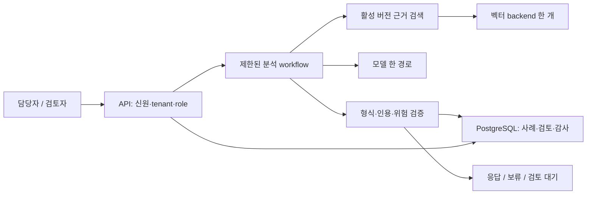

# Enterprise AI Knowledge & Risk Copilot · 새 교재 기반 2주 MVP 설계

## 해결할 고객 문제와 범위

정책을 읽는 담당자가 같은 질문에 일관된 근거를 찾고, 근거 없는 답은 보류하며, 고위험 사례는 권한 있는 검토자가 결정하도록 돕는다. 대상은 **합성 텍스트 정책 12–24개, tenant 2개, 한 활성 정책 버전**이다. 개인/회사 비공개 자료는 사용하지 않는다.

W1–W8은 학습과 모듈 준비, W9–W10은 **준비된 모듈의 통합·검증·시연 44시간**이다. 기존처럼 GPU학습·Milvus·Redis·LangGraph·여러 모델·AWS/K8s 운영을 한 번에 완성하는 범위는 2주 필수에서 제외했다.

## 필수 결과와 선택 확장

| 필수 MVP | 선택 확장 |
|---|---|
| FastAPI 입력/결과/조회와 명확한 오류 | 풍부한 웹 UI |
| 실제 모델 1경로 + 검색 backend 1개 | 여러 공급자/모델 비교 |
| 근거 인용·보류·고위험 검토의 3경로 | 멀티모달·다중 에이전트 |
| 서버 신원/tenant/role 검증·검토 권한 | 공개 서비스용 OIDC 통합 심화 |
| PostgreSQL 사례/검토/감사와 원자적 갱신 | 별도 worker/큐/outbox 운영 |
| 실제 검색의 tenant/활성version 조건 | 두 번째 벡터 DB·임베딩 미세 조정 |
| Compose 기동·지속성·별도 백업 복원 + 로컬 Kubernetes API 배포·롤백 학습 증거 | 실제 AWS 배포·운영 Kubernetes HA |
| dev20 + 동결 holdout30 질문, raw결과/조건 | 200+질문·독립 전문가 평가 |
| 최소 구조화 로그·CI·ADR·5분 데모 | Redis/전체 OTel/자동 비용 라우팅 |

검색 backend를 선택할 때 외부 의존성/비용/데이터 경계를 명시한다. Milvus를 선택하면 지원 환경과 운영 시간을 확인한다. W8까지 검증한 하나를 쓰고, 실제 모델 접근이 없으면 fixture 프로토타입까지만 완료했다고 표시한다.

## 논리 아키텍처



배포 설계는 공개 API 입구와 비공개 DB를 분리한다. 로컬 demo는 서버가 보관한 테스트 신원 매핑을 사용하고 실제 인터넷용 인증과 구분한다. 공개 배포를 선택하면 검증된 issuer/audience/서명/만료와 비밀 관리가 추가 조건이다.

## API·상태 계약

| 동작 | 목표 결과 | 실패/경계 |
|---|---|---|
| POST /cases/analyze | 유효 입력 접수·ID 반환, 분석 경로 진행 | 잘못된 입력422; 202는 접수 의미 |
| GET /cases/{id} | 같은 tenant 사례의 저장된 상태·결과 | 없거나 허용되지 않은 사례404 |
| POST /cases/{id}/reviews | reviewer가 대기 사례 승인/거절 | 인증/인가 실패401/403; 상태/version충돌409 |
| GET /health | 프로세스 응답200 | 의존성 준비까지 보장하지 않음 |
| GET /readiness | 핵심 의존성 준비200 | 준비 실패503 |

RECEIVED → ANALYZED → ANSWERED / ABSTAINED / REVIEW_PENDING.
REVIEW_PENDING → APPROVED / REJECTED는 검토자만 실행한다. 기술 처리 실패는 FAILED이며 답변 보류와 구분한다. API가 비동기 접수202를 유지하면 지속 작업 기록/재개 경로가 필요하다. 인메모리 BackgroundTasks만으로 내구성 있는 처리라고 보고하지 않는다. 짧은 동기 분석으로 바꾸는 경우 HTTP/응답 계약 변경을 ADR에 남긴다.

```json
{
  "case_id": "case-001",
  "status": "REVIEW_PENDING",
  "answer": null,
  "evidence_ids": ["tenant-a:refund:v2:chunk-1"],
  "review_reason": "HIGH_RISK",
  "case_version": 2,
  "run_id": "run-001"
}
```

예시 JSON은 목표 계약이다. tenant/actor는 서버가 검증한 신원 컨텍스트에서 얻고 본문의 값을 권한으로 신뢰하지 않는다. 근거는 source/version/chunk와 연결하고 모델이 만든 임의 ID는 거부한다.

## 반드시 확인할 실패 조건

다른 tenant/비활성 정책의 검색 근거, 없는 인용 ID, 근거와 다른 답, 근거 부족, 모델timeout/형식오류, viewer승인, 최종상태 중복검토, 동시검토, 감사저장실패, DB재시작/복원. 보류와 검토는 실제 결과 종류이며 통신 오류를 성공한 보류로 숨기지 않는다.

## 평가·완료 판단

dev20은 설정 선택에 사용한다. 최종30 holdout은 질문·gold근거·답변가능여부를 동결하고 설정 선택에서 분리한다. 50은 두 세트 합계로 보고한다. 검색 Recall/MRR, 근거 의미 일치, 보류 적절성, 형식 성공, 권한/전이, P50/P95, 성공 요청당 비용, 검토 비율을 분리한다. 목표 수치는 W8에 데이터/모델/환경/동시성 조건과 동결하며 실제 미달값도 남긴다.

권한·필터·전이 필수 회귀가 실패하면 안전 gate를 완료하지 않는다. 작은 합성 평가의 통과는 실제 기업 운영/모든 공격에 대한 보장이 아니다. 자체 수용 기준 통과와 품질 목표 달성도 구분해 보고한다.

W8 6가지 준비 자산이 미완료면 W9 시작을 옮기거나 범위를 줄인다. 제작2주는 조건부 추정이다. GPU미세조정·실제클라우드·멀티모달 미실행은 포트폴리오의 '다음 단계'에 적는다.

[W9 통합 레시피](curriculum/week-09.md) · [W10 최종 검증](curriculum/week-10.md) · [준비 학습표](curriculum/README.md)


## 개편된 교재·영상과 구현 자산

주교재 『AI 에이전트 엔지니어링』13장. W1 계약/입력·UX → W2 지식/검색 → W3 평가/k6 → W4 도구/비동기 → W5 상태/트랜잭션/신원 → W6 개선/비용/IaC → W7 관측/컨테이너/Kubernetes/CI/복구 → W8 인간 협업/고객 제안으로 준비한다. 각 주차 영상은 [교재](curriculum/README.md)에 실제 URL·보는 시점·연결 실습으로 배정했다.

**필수 학습 깊이:** Dockerfile/Compose로 API와 PostgreSQL을 재현 기동하고 백업/복원한다. 로컬 Kubernetes에 API를 배포해 Service·probes·requests/limits·ConfigMap/Secret·로그·롤백을 검증한다. W3 클러스터 기초와 W7 배포 실습을 재사용한다. 전체 DB의 Kubernetes 운영, HA, 실제 관리형 클러스터는 선택 심화다. 최종 데모 전체 스택은 Compose로 재현할 수 있고, K8s 학습 증거는 별도로 연결한다.

Terraform 로컬 plan/state 실습과 GitHub Actions 검증 기록을 함께 남긴다. 책 8장의 큐/메시징을 고려하되 내구성이 필요한 비동기 202 경로는 작업 상태/재개/멱등성을 실제 구현해 확인한다. in-memory BackgroundTasks만으로 작업 지속성을 주장하지 않는다. 워크플로/멀티 에이전트·관리형 컨테이너/Kubernetes·build/buy 선택은 ADR과 비용표로 설명한다.
